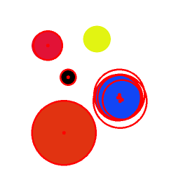
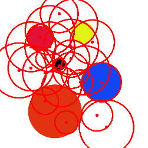
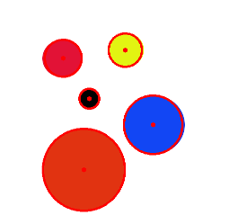
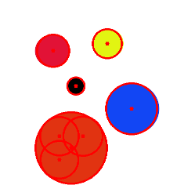
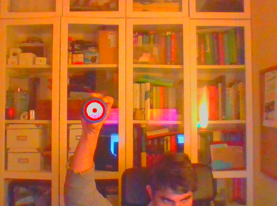

# webcam_circles
Circle detection from online webcam images

# Perception Exercise 1.4

### Parameters of the Hough Transform

The first obvious parameters that influence in the detection result is the min and max radius for the circles (MIN_RADIUS and MAX_RADIUS). These radius are in pixels, and for example if limiting too much the max radius, the bigger circles in the image won't be successfully detected.

Here is the image I have been using to test the different parameters.

Another parameters is the minimum distance between centers of circles, MIN_CIRCLE_DIST. If you setup this number too low, a lot of false circles will appear in the neighborhood of the true circle. For example, see what happens to the blue circle:

The parameter in the code HOUGH_ACCUM_RESOLUTION is documented as dp in the API and is the inverse ratio of the accumulator resolution to the image resolution. This parameter defines how precise can the detection be.

The parameter CANNY_EDGE_TH is a parameter for the Canny algorithm used by the function HoughCircles() to detect edges in the original images. The value affects on how Canny performs in edge tracking by hysteresis. In my example image, lowering this threshold makes possible to detect the yellow circle.

Finally, the parameter HOUGH_ACCUM_TH is the threshold used in the accumulator above which we will consider there is a circle. If this number is very low, the detector will find a lot of false circles.

## Tuning for real images

The parameters for detecting circles in real video images (not fixed synthetic), can be very different from the previous values. I found that the ones already configured in the software are working well, with minor adjustments depending on the light in the room.

### Sources:

https://docs.opencv.org/2.4/modules/imgproc/doc/feature_detection.html?highlight=houghcircles#houghcircles

https://en.wikipedia.org/wiki/Canny_edge_detector
